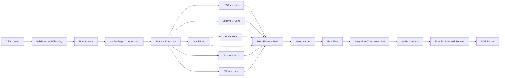
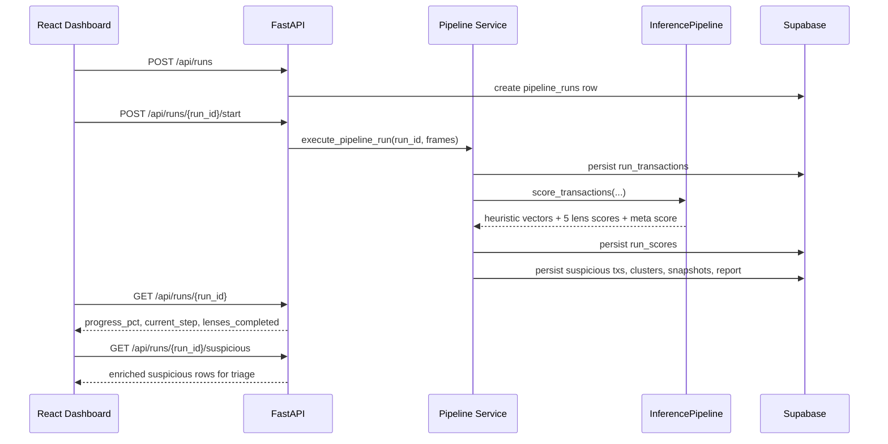
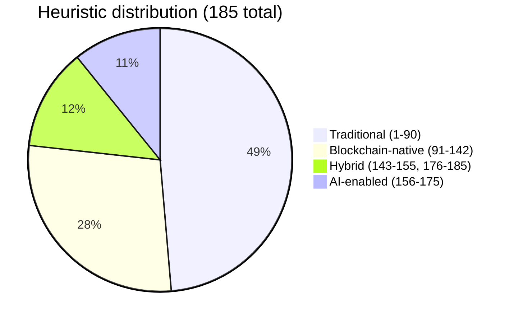

# Cicada AML

**Repository for the Cicada AML application: a full-stack blockchain AML investigation platform built around heuristics-first detection, multi-lens ML scoring, clustering, and investigator-ready reporting.**

[](https://www.python.org/downloads/)
[](https://fastapi.tiangolo.com/)
[](https://react.dev/)
[](https://vitejs.dev/)
[](https://tailwindcss.com/)
[](LICENSE)

> **Gist:** analysts upload blockchain transaction CSVs, the backend builds a wallet graph, evaluates 185 AML heuristics, runs 5 ML lens models, stacks them into a meta-risk score, clusters suspicious wallets, and surfaces the results in a dashboard with flow exploration, explanations, reports, and SAR export.

## Why this app exists

### The blockchain money-laundering problem

Blockchain money laundering is hard because the ledger is public but the actors are not. Criminals exploit:

- pseudonymous wallet creation
- rapid cross-border settlement
- multi-hop layering across wallets and chains
- mixers, OTC desks, bridges, and cash-out infrastructure
- automated fragmentation and reconsolidation patterns that look simple in isolation but suspicious in aggregate

This is not a niche problem:

- The IMF cites long-running global estimates that money laundering accounts for roughly **2% to 5% of global GDP**.
- UNODC estimated roughly **$1.6T** in criminal proceeds laundered in 2009, or **2.7% of global GDP**.
- Chainalysis reported that known on-chain money-laundering activity grew from roughly **$10B in 2020** to **more than $82B in 2025**.
- Chainalysis also reported that Chinese-language money laundering networks accounted for about **20% of known crypto laundering activity in 2025**.

For blockchain investigators, the challenge is less "can we see transactions?" and more "can we separate ordinary high-volume flow from purposeful obfuscation fast enough to matter?"

### Our novel approach

This repo takes a deliberately opinionated approach:

1. **Heuristics first, ML second.** Domain rules fire before model fusion, so typology knowledge is preserved rather than buried.
2. **Five specialized ML lenses.** Instead of one monolithic classifier, the system scores behavior, graph position, common control, temporal sequencing, and off-ramp activity separately.
3. **Batch inference over whole runs.** The pipeline computes graph features once, then scores entire runs in vectorized batches for throughput.
4. **Calibrated meta fusion.** A meta-learner combines lens outputs, heuristic aggregates, and data-availability flags into a normalized risk probability.
5. **Investigation-aware downstream logic.** Suspicious selection retains `medium-low` and heuristic-driven rows, cluster typology is inferred with adaptive graph logic, and flow snapshots are annotated for analyst review.

## At a glance

| Area | Current repo state |
| --- | --- |
| Heuristic engine | `185` registered heuristics across 4 environment modules |
| ML lenses | `5` lens models: behavioral, graph, entity, temporal, off-ramp |
| Meta features | `17` stacked meta-learner inputs |
| Pipeline uploads | Up to `3` CSV files per run |
| Required CSV headers | `transaction_id`, `sender_wallet`, `receiver_wallet`, `amount`, `timestamp` |
| API stack | FastAPI + Supabase-backed repositories |
| Frontend | React 19 + Vite 6 + Tailwind 4 |
| Graph engine | NetworkX for construction, PyTorch Geometric for graph lens inference |
| Persistence | Supabase tables + row-level security for run-scoped data |
| Tests | `30` backend `pytest` modules |
| Migrations | `26` SQL migrations in `supabase/migrations/` |

## Product use case

This system is designed for:

- compliance teams triaging suspicious blockchain activity
- investigators reviewing wallet clusters and transaction flows
- AML product teams evaluating heuristics and model fusion strategies
- demo or research environments where analysts need explainable blockchain risk scoring from CSV uploads

Typical analyst workflow:

1. Upload one to three CSV files.
2. Start a pipeline run.
3. Watch progress as features, heuristics, lenses, and the meta-learner execute.
4. Review suspicious transactions, wallet aggregates, and cluster typologies.
5. Open the Flow Explorer for graph context.
6. Generate structured report summaries or SAR output.

## Architecture

### System flow



### Pipeline lifecycle



### Heuristic environment mix



## Detection strategy

### Heuristics-first scoring

The heuristic runner executes all `185` rules per transaction and returns:

- `heuristic_vector`
- `applicability_vector`
- `triggered_ids`
- `triggered_count`
- `top_typology`
- `top_confidence`
- `top_k_triggers`
- `explanations`

Heuristics are implemented under `backend/app/ml/heuristics/` and registered centrally in `backend/app/ml/heuristics/registry.py`.

Key implementation details:

- registry completeness is tested against the full `1..185` range
- fired heuristic IDs are normalized before persistence so non-zero vector entries are not lost
- heuristic labels are resolved back to human-readable names for UI consumers
- suspicious selection can include heuristic-only rows when confidence is non-trivial

### Five lens models

| Lens | File | Primary model | Input shape | What it captures |
| --- | --- | --- | --- | --- |
| Behavioral | `backend/app/ml/lenses/behavioral_model.py` | XGBoost + PyTorch autoencoder | 12 behavioral features | economically unnecessary activity, burstiness, amount deviation, relay patterns |
| Graph | `backend/app/ml/lenses/graph_model.py` | GAT or GCN via PyTorch Geometric | node features + edge index | structural role, centrality, graph topology |
| Entity | `backend/app/ml/lenses/entity_model.py` | Louvain communities + XGBoost classifier | cluster-level graph and embedding features | common control and coordinated wallet groups |
| Temporal | `backend/app/ml/lenses/temporal_model.py` | LSTM | wallet transaction sequences up to length 50 | cadence, burst timing, sequence signatures |
| Off-ramp | `backend/app/ml/lenses/offramp_model.py` | XGBoost | 8 off-ramp features + heuristic aggregates | cash-out, exit, and conversion patterns |

### Meta-learner

The meta-learner lives in `backend/app/ml/training/train_meta.py` and stacks `17` inputs:

- 6 score features: `behavioral_score`, `behavioral_anomaly_score`, `graph_score`, `entity_score`, `temporal_score`, `offramp_score`
- 5 heuristic aggregates: `heuristic_mean`, `heuristic_max`, `heuristic_triggered_count`, `heuristic_top_confidence`, `heuristic_triggered_ratio`
- 5 coverage flags: `has_entity_intel`, `has_address_tags`, `coverage_tier_0`, `coverage_tier_1`, `coverage_tier_2`
- 1 availability signal: `n_lenses_available`

Important behavior:

- trained meta models are wrapped with a Platt sigmoid calibrator
- if `models/meta/meta_model.pkl` is absent, inference falls back to a documented weighted fusion
- risk tiers are derived from `decision_threshold`, `high_risk_threshold`, and `low_risk_ceiling`

Fallback fusion weights in the current code:

| Feature | Weight |
| --- | ---: |
| `behavioral_score` | `0.225` |
| `graph_score` | `0.175` |
| `entity_score` | `0.125` |
| `temporal_score` | `0.175` |
| `offramp_score` | `0.125` |
| `heuristic_max` | `0.175` |

### Cluster typology inference

Cluster typology inference is not a simple degree-threshold shortcut anymore. `backend/app/ml/typology_taxonomy.py` now combines:

- uploaded ground-truth typology columns when present
- cross-chain detection from chain diversity
- weighted voting from per-transaction heuristic typologies
- adaptive graph structure rules
- off-ramp lens pressure for exit-focused clusters

Canonical cluster labels currently include:

- `many-to-one collection`
- `cross-chain bridge hop`
- `fan-out`
- `circular loop / round-tripping`
- `reconsolidation`
- `offramp exits`
- `peel chain`
- `layering`

## What the app surfaces

### Backend outputs persisted per run

| Table | Purpose |
| --- | --- |
| `pipeline_runs` | run lifecycle, progress, ownership, counts |
| `run_transactions` | cleaned uploaded rows |
| `run_scores` | per-transaction lens scores, meta score, heuristic metadata |
| `run_suspicious_txns` | suspicious subset used for triage and reports |
| `run_clusters` | suspicious wallet clusters |
| `run_cluster_members` | wallet membership per cluster |
| `run_graph_snapshots` | Cytoscape-compatible graph elements |
| `run_reports` | structured report JSON |
| `sar_reports` | SAR metadata and generated PDF references |

### Frontend investigation surfaces

| Page | Route | Purpose |
| --- | --- | --- |
| Landing | `/` | product overview and high-level metrics |
| Dashboard | `/dashboard` | run metrics, risk cards, model performance |
| Transactions | `/dashboard/transactions` | suspicious transaction queue |
| Wallets | `/dashboard/wallets` | wallet-level aggregation and detail |
| Flow Explorer | `/dashboard/flow-explorer` | cluster graph navigation |
| Reports | `/dashboard/reports` | run report and summary review |
| Network cases | `/dashboard/network-cases` | case-oriented network views |

### UI features tied directly to the backend

- run progress bar with `progress_pct`, `current_step`, and `lenses_completed`
- heuristic badges using stored `heuristic_triggered` IDs and resolved labels
- threshold-aware risk tiers from `GET /api/runs/model/threshold`
- flow graph annotation using wallet-level risk metadata
- wallet timelines built from suspicious transactions touching the selected wallet
- model performance visualizations driven by artifact endpoints when metrics exist

## API surface

### Health

- `GET /health`

### Pipeline runs

- `POST /api/runs`
- `POST /api/runs/{run_id}/start`
- `GET /api/runs`
- `GET /api/runs/{run_id}`
- `GET /api/runs/{run_id}/scores`
- `GET /api/runs/{run_id}/suspicious`
- `GET /api/runs/{run_id}/wallets`
- `GET /api/runs/{run_id}/clusters`
- `GET /api/runs/{run_id}/clusters/{cluster_id}/graph`
- `GET /api/runs/{run_id}/clusters/{cluster_id}/members`
- `GET /api/runs/{run_id}/report`
- `GET /api/runs/{run_id}/report/summary`
- `POST /api/runs/{run_id}/report/summary`
- `GET /api/runs/dashboard/stats`
- `GET /api/runs/model/metrics`
- `GET /api/runs/model/threshold`

### Heuristics and explanations

- `GET /api/heuristics/registry`
- `GET /api/heuristics/stats`
- `GET /api/heuristics/{transaction_id}`
- `GET /api/explanations/{transaction_id}`
- `GET /api/explanations/case/{case_id}`

### Reports and SAR

- `GET /api/reports`
- `POST /api/reports/generate/{case_id}`
- `GET /api/reports/{report_id}`
- `GET /api/reports/{report_id}/download`
- `POST /api/reports/{report_id}/generate-sar`
- `GET /api/reports/sar/{sar_id}/download`

### Other routes

- `GET /api/transactions`
- `GET /api/transactions/{transaction_id}`
- `POST /api/transactions/score`
- `GET /api/wallets`
- `GET /api/wallets/{address}`
- `GET /api/wallets/{address}/graph`
- `GET /api/networks`
- `GET /api/networks/{case_id}`
- `GET /api/networks/{case_id}/graph`
- `POST /api/networks/detect`
- `GET /api/metrics/typology`
- `GET /api/metrics/cohort`
- `GET /api/metrics/drift`
- `GET /api/policies/thresholds`
- `PUT /api/policies/thresholds/{cohort_key}`
- `POST /api/ingest/csv`
- `POST /api/ingest/elliptic`

## Quick start

### Prerequisites

| Requirement | Notes |
| --- | --- |
| Python 3.11+ | 3.12 and 3.13 are supported by the repo setup |
| Node.js 20+ | matches the Vite 6 and React 19 toolchain |
| Supabase project | required for auth and persistence |
| Optional GPU | PyTorch can use CUDA or Apple MPS; XGBoost GPU requires compatible wheels |

### 1. Clone

```bash
git clone <your-fork-url> Aegis-AML
cd Aegis-AML
```

### 2. Create one repo-root virtual environment

```bash
py -3.13 -m venv .venv
.\.venv\Scripts\Activate.ps1
pip install -U pip
pip install -r backend/requirements.txt
```

### 3. Configure backend

```bash
copy backend\.env.example backend\.env
```

Important backend variables:

| Variable | Purpose |
| --- | --- |
| `SUPABASE_URL` | project URL |
| `SUPABASE_KEY` | anon/public key |
| `SUPABASE_SERVICE_ROLE_KEY` | server-side access for backend operations |
| `SUPABASE_JWT_SECRET` | optional fallback for HS256 token verification |
| `FALLBACK_RISK_THRESHOLD` | default decision threshold when no trained artifact exists |
| `ML_USE_GPU` | enable or disable GPU-backed inference |
| `OPENAI_API_KEY` | enables LLM-generated run summaries |
| `OPENAI_MODEL` | defaults to `gpt-4o-mini` |
| `OPENAI_BASE_URL` | optional override for compatible endpoints |

### 4. Configure frontend

```bash
cd frontend
npm install
copy .env.example .env
cd ..
```

Important frontend variables:

| Variable | Purpose |
| --- | --- |
| `VITE_SUPABASE_URL` | same Supabase project URL |
| `VITE_SUPABASE_ANON_KEY` | client-side anon key |
| `VITE_API_PROXY_TARGET` | dev proxy target, defaults to `http://127.0.0.1:8000` |

### 5. Apply database migrations

Run the SQL files in `supabase/migrations/` in numeric order from `001` to `026`.

Migration themes:

| Range | Purpose |
| --- | --- |
| `001-015` | core AML entities and scoring tables |
| `016-017` | schema hardening and auth profiles |
| `018-023` | pipeline-run execution and reporting tables |
| `024-026` | SAR report support |

### 6. Start the stack

Backend:

```bash
cd backend
python -m uvicorn app.main:app --reload --reload-dir app --host 0.0.0.0 --port 8000
```

Frontend:

```bash
cd frontend
npm run dev
```

Then open `http://localhost:5173`.

## Training pipeline

### Repo-level shortcuts

| Command | Purpose |
| --- | --- |
| `make train-all` | full feature-to-meta training pipeline |
| `make features` | generate processed features from raw data |
| `make subset-processed` | create smaller processed dataset for iteration |
| `make train-lenses-parallel` | train behavioral, graph, temporal, and off-ramp lenses in parallel |
| `make train-entity` | train entity classifier |
| `make score-training-data` | score training data with trained lenses |
| `make prepare-meta-features` | build `meta_features.csv` |
| `make train-meta` | train calibrated meta-learner |

### Artifact locations

| Artifact area | Path |
| --- | --- |
| Behavioral | `models/behavioral/` |
| Graph | `models/graph/` |
| Entity | `models/entity/` |
| Temporal | `models/temporal/` |
| Off-ramp | `models/offramp/` |
| Meta | `models/meta/` |
| Reports and metrics | `models/artifacts/` |

Notes:

- `models/artifacts/feature_importance.csv` is committed
- `metrics_report.json` and `threshold_config.json` are generated by training and are not currently committed
- when threshold artifacts are absent, backend inference falls back to config defaults and the frontend may receive `null` threshold metadata

## Data contracts and scoring semantics

### CSV schema

Minimum required columns for run uploads:

| Column | Type |
| --- | --- |
| `transaction_id` | string |
| `sender_wallet` | string |
| `receiver_wallet` | string |
| `amount` | numeric |
| `timestamp` | parseable datetime |

Optional columns already supported by parts of the pipeline include:

- `tx_hash`
- `asset_type`
- `chain_id`
- `fee`
- `label`
- `label_source`
- typology-like labels such as `typology`, `aml_pattern`, `pattern_type`, and related aliases

### Risk tiers

Risk levels are assigned as:

| Condition | Level |
| --- | --- |
| `meta_score >= high_risk_threshold` | `high` |
| `meta_score >= decision_threshold` | `medium` |
| `meta_score <= low_risk_ceiling` | `low` |
| otherwise | `medium-low` |

### Suspicious transaction selection

The current run pipeline treats a transaction as suspicious if any of the following is true:

- `meta_score >= decision_threshold`
- `risk_level` is `high`, `medium`, or `medium-low`
- the uploaded row label implies illicit or suspicious activity
- at least one heuristic fired and `heuristic_top_confidence >= 0.15`

This behavior matters because it preserves analyst-relevant rows that a strict threshold-only filter would drop.

## Repo structure

```text
Aegis-AML/
|-- backend/
|   |-- app/
|   |   |-- api/
|   |   |-- ml/
|   |   |   |-- heuristics/
|   |   |   |-- lenses/
|   |   |   `-- training/
|   |   |-- repositories/
|   |   |-- schemas/
|   |   |-- services/
|   |   `-- utils/
|   |-- scripts/
|   `-- tests/
|-- frontend/
|   `-- src/
|-- models/
|-- docs/
|-- scripts/
`-- supabase/
```

## Documentation map

| File | Purpose |
| --- | --- |
| `docs/pipeline-audit.md` | current pipeline review with resolved/open findings |
| `docs/behavioral_lens_report.md` | behavioral lens design details |
| `docs/graph_lens_report.md` | graph lens design details |
| `docs/entity_lens_report.md` | entity lens design details |
| `docs/temporal_lens_report.md` | temporal lens design details |
| `docs/offramp_lens_report.md` | off-ramp lens design details |
| `CONTRIBUTING.md` | contribution workflow |

## Testing

Backend:

```bash
cd backend
python -m pytest tests -v
```

Frontend:

```bash
cd frontend
npm run lint
npx tsc --noEmit
```

The backend test suite covers heuristics, lenses, scoring, pipeline runs, SAR generation, storage, audit behavior, API routes, and threshold policy logic.

## Known gaps

- trained `metrics_report.json` and `threshold_config.json` are generated artifacts, not committed defaults
- some README statistics in the UI depend on those artifacts and fall back when absent
- the lens deep-dive docs contain model-level design detail and should be treated as engineering references, not strict guarantees of current production metrics unless artifacts are present in `models/artifacts/`

## References

- IMF, *Straight Talk: Cleaning Up*: https://www.imf.org/en/Publications/fandd/issues/2018/12/imf-anti-money-laundering-and-economic-stability-straight
- UNODC, *Illicit money: how much is out there?*: https://www.unodc.org/lpo-brazil/en/frontpage/2011/10/26-ilicit-money-how-much-is-there.html
- FATF, *Virtual Assets*: https://www.fatf-gafi.org/en/publications/Virtualassets/Virtual-assets.html
- Chainalysis, *Chinese Language Money Laundering Networks Emerge as Major Facilitators of the Illicit Crypto Economy*: https://www.chainalysis.com/blog/2026-crypto-money-laundering/

## License

MIT. See [LICENSE](LICENSE).
